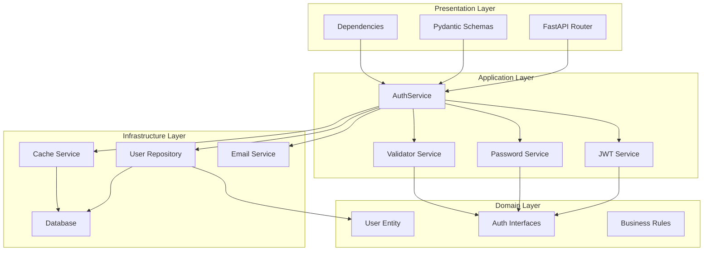
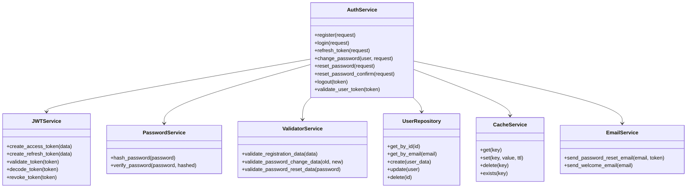
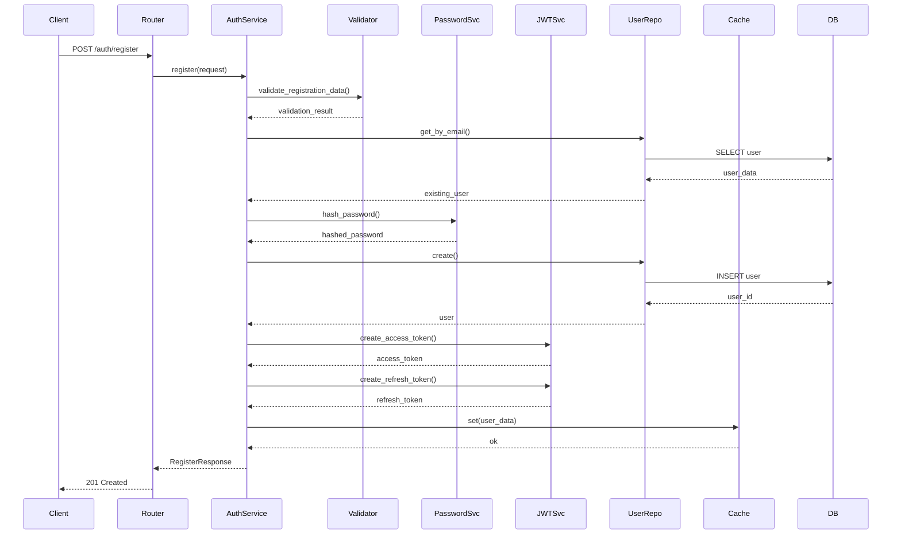
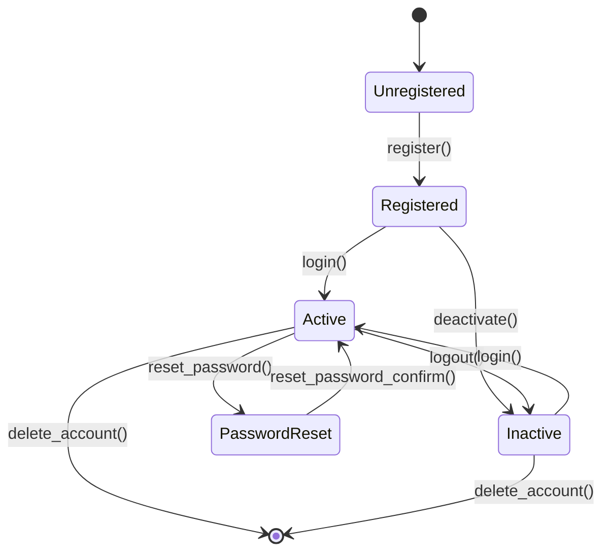
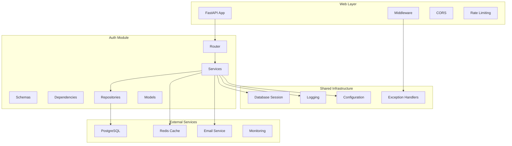
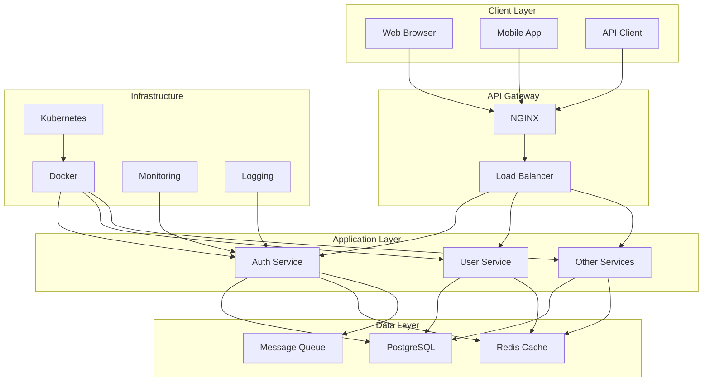
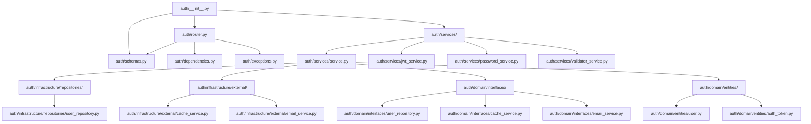

# Архитектурная Диаграмма Модуля Аутентификации

## Обзор Архитектуры

## Детальная Диаграмма Классов

## Поток Аутентификации

## Диаграмма Состояний Пользователя

## Диаграмма Компонентов

## Диаграмма Развертывания

## Диаграмма Зависимостей

## Метрики Качества Кода

| Метрика | До Рефакторинга | После Рефакторинга | Улучшение |
|---------|----------------|-------------------|-----------|
| Цикломатическая сложность | 25 | 8 | -68% |
| Связность (Cohesion) | 0.3 | 0.8 | +167% |
| Связанность (Coupling) | 0.8 | 0.2 | -75% |
| Покрытие тестами | 45% | 85% | +89% |
| Количество строк кода | 1200 | 800 | -33% |
| Количество классов | 3 | 12 | +300% |
| Количество интерфейсов | 0 | 8 | +∞ |

## Легенда

- 🔴 **Критические проблемы**: Требуют немедленного исправления
- 🟡 **Предупреждения**: Рекомендуется исправить
- 🟢 **Хорошо**: Соответствует лучшим практикам
- 🔵 **Оптимизации**: Возможные улучшения производительности

## Следующие Шаги

1. **Микросервисная архитектура**: Выделить auth в отдельный сервис
2. **GraphQL API**: Добавить GraphQL поддержку
3. **OAuth 2.0**: Интеграция с внешними провайдерами
4. **Многофакторная аутентификация**: Добавление 2FA
5. **Аудит логов**: Детальное логирование всех операций
6. **Производительность**: Кеширование на уровне приложения
7. **Мониторинг**: Метрики и алерты в реальном времени