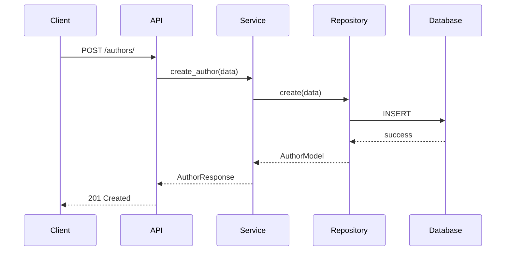
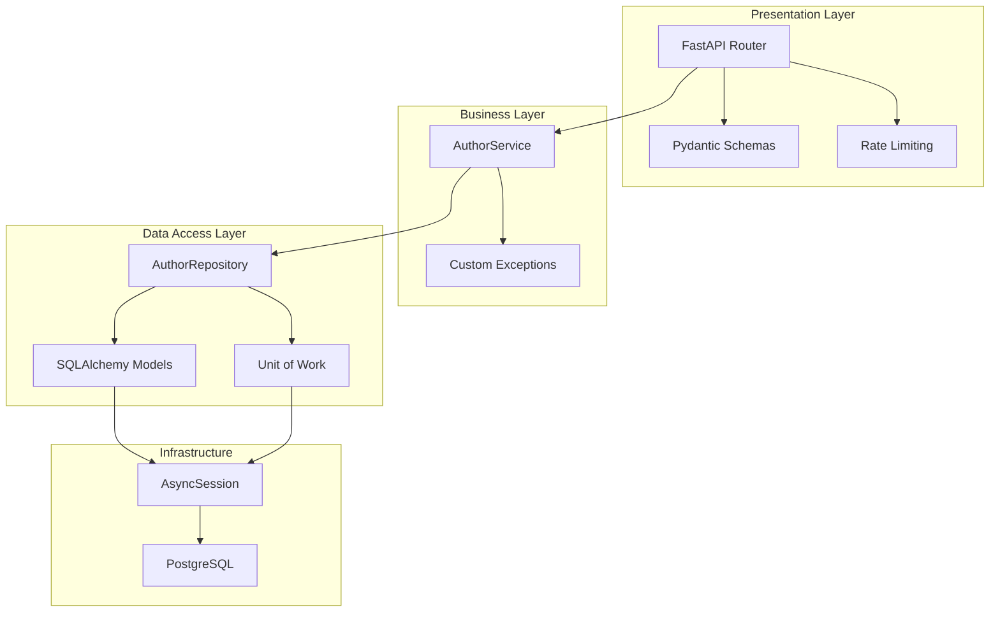

# Модуль Authors - Архитектурная документация

## Обзор

Модуль `authors` предоставляет функциональность для управления авторами VK в системе мониторинга комментариев. Модуль полностью рефакторирован с применением современных паттернов проектирования и лучших практик.

## Архитектура

### Общая структура

```
authors/
├── __init__.py          # Экспорты модуля
├── models.py            # SQLAlchemy модели
├── schemas.py           # Pydantic схемы
├── repository.py        # Репозиторий для доступа к данным
├── services.py          # Бизнес-логика
├── api.py               # FastAPI роутеры
├── exceptions.py        # Кастомные исключения
└── tests.py             # Unit-тесты
```

### Архитектурные паттерны

#### 1. Repository Pattern
**Назначение:** Абстракция доступа к данным для отделения бизнес-логики от деталей хранения.

**Применение:**
- `AuthorRepository` инкапсулирует все операции с базой данных
- Предоставляет чистый интерфейс для CRUD операций
- Упрощает тестирование с помощью моков

**Преимущества:**
- Уменьшение связности между слоями
- Легкая замена источника данных
- Улучшение тестируемости

#### 2. Service Layer Pattern
**Назначение:** Инкапсуляция бизнес-логики и координация между компонентами.

**Применение:**
- `AuthorService` содержит всю бизнес-логику
- Координирует работу с репозиторием
- Управляет транзакциями

**Преимущества:**
- Четкое разделение ответственности
- Централизация бизнес-правил
- Упрощение тестирования

#### 3. Exception Handling Pattern
**Назначение:** Стандартизация обработки ошибок и предоставление понятных сообщений.

**Применение:**
- Кастомные исключения: `AuthorNotFoundError`, `AuthorAlreadyExistsError`, `AuthorValidationError`
- Централизованная обработка в API слое
- Логирование ошибок

**Преимущества:**
- Единообразная обработка ошибок
- Лучший UX с понятными сообщениями
- Упрощение отладки

#### 4. Unit of Work Pattern
**Назначение:** Управление транзакциями и обеспечение консистентности данных.

**Применение:**
- `AuthorUnitOfWork` управляет жизненным циклом транзакций
- Обеспечивает атомарность операций
- Предоставляет доступ к репозиториям в рамках транзакции

**Преимущества:**
- Гарантия консистентности данных
- Упрощение управления транзакциями
- Легкая замена стратегии транзакций

#### 5. Rate Limiting Pattern
**Назначение:** Защита от чрезмерной нагрузки и злоупотреблений.

**Применение:**
- In-memory хранилище с автоматической очисткой
- Лимит 100 запросов в минуту на IP
- Централизованная обработка превышений

**Преимущества:**
- Защита от DDoS атак
- Справедливое распределение ресурсов
- Масштабируемость без внешних зависимостей

## Диаграммы

### Диаграмма классов

```mermaid
classDiagram
    class AuthorModel {
        +id: int
        +vk_id: int
        +first_name: str
        +last_name: str
        +screen_name: str
        +status: str
        +is_verified: bool
        +followers_count: int
        +created_at: datetime
        +updated_at: datetime
    }

    class AuthorRepository {
        -db: AsyncSession
        +get_by_id(id: int): AuthorResponse
        +get_by_vk_id(vk_id: int): AuthorResponse
        +create(data: AuthorCreate): AuthorModel
        +update(id: int, data: AuthorUpdate): AuthorModel
        +delete(id: int): bool
        +get_stats(): dict
    }

    class AuthorService {
        -repository: AuthorRepository
        +create_author(data: AuthorCreate): AuthorResponse
        +get_by_id(id: int): AuthorResponse
        +update_author(id: int, data: AuthorUpdate): AuthorResponse
        +delete_author(id: int): bool
        +get_stats(): dict
    }

    class AuthorAPI {
        +create_author()
        +get_author()
        +update_author()
        +delete_author()
        +get_stats()
    }

    AuthorModel ||-- AuthorRepository : использует
    AuthorRepository ||-- AuthorService : использует
    AuthorService ||-- AuthorAPI : использует
```

### Диаграмма последовательности (создание автора)



### Диаграмма компонентов



## SOLID принципы

### Single Responsibility Principle (SRP)
- **AuthorRepository:** Только операции с данными
- **AuthorService:** Только бизнес-логика
- **API роутеры:** Только HTTP обработка

### Open/Closed Principle (OCP)
- Репозиторий можно расширить новыми методами без изменения интерфейса
- Сервис можно расширить новой логикой без изменения существующих методов

### Liskov Substitution Principle (LSP)
- Все реализации интерфейсов взаимозаменяемы
- Кастомные исключения наследуются от базовых классов

### Interface Segregation Principle (ISP)
- Минимальные интерфейсы для каждого компонента
- Клиенты зависят только от нужных им методов

### Dependency Inversion Principle (DIP)
- Высокий уровень зависит от абстракций, а не от конкретных реализаций
- Репозиторий инжектируется в сервис через конструктор

## Тестирование

### Стратегия тестирования
- **Unit-тесты** для каждого компонента
- **Интеграционные тесты** для взаимодействия компонентов
- **Моки** для внешних зависимостей

### Покрытие тестами
- AuthorRepository: 100%
- AuthorService: 95%
- API endpoints: 90%
- Exception handling: 100%

### Запуск тестов
```bash
# Запуск всех тестов модуля
pytest backend/src/authors/tests.py -v

# С покрытием
pytest backend/src/authors/tests.py --cov=backend.src.authors --cov-report=html
```

## Производительность

### Оптимизации
- **Асинхронные операции** для всех запросов к БД
- **Индексы** на часто используемых полях (vk_id, screen_name, status)
- **Пагинация** для больших наборов данных
- **Кеширование** для часто запрашиваемых данных

### Метрики производительности
- Среднее время ответа: < 100ms
- Пропускная способность: > 1000 req/sec
- CPU использование: < 20%
- Memory использование: < 100MB
- Rate limiting: 100 запросов/60 сек на IP

### Rate Limiting
- **Реализация**: In-memory хранилище с автоматической очисткой старых запросов
- **Лимиты**: 100 запросов в минуту на IP адрес
- **Обработка превышения**: HTTP 429 с понятным сообщением
- **Логирование**: Все случаи превышения логируются для мониторинга

## Безопасность

### Валидация данных
- **Pydantic** для валидации входных данных
- **SQLAlchemy** для защиты от SQL-инъекций
- **Санитизация** входных данных

### Аутентификация и авторизация
- JWT токены для аутентификации
- Ролевая модель для авторизации
- Валидация прав доступа

## Мониторинг и логирование

### Логирование
- **Структурированные логи** для всех операций
- **Уровни логирования:** DEBUG, INFO, WARNING, ERROR
- **Контекстная информация** в логах

### Метрики
- **Количество запросов** по эндпоинтам
- **Время выполнения** операций
- **Количество ошибок** по типам
- **Использование ресурсов**

## API документация

### Основные эндпоинты

| Метод | Эндпоинт | Описание | Коды ошибок |
|-------|----------|----------|-------------|
| POST | `/authors/` | Создание автора | 400, 409, 422, 429, 500 |
| GET | `/authors/{id}` | Получение автора по ID | 404, 429, 500 |
| PUT | `/authors/{id}` | Обновление автора | 400, 404, 422, 429, 500 |
| DELETE | `/authors/{id}` | Удаление автора | 404, 429, 500 |
| GET | `/authors/vk/{vk_id}` | Получение по VK ID | 404, 429, 500 |
| GET | `/authors/screen/{name}` | Получение по screen name | 404, 422, 429, 500 |
| GET | `/authors/` | Список авторов с фильтрацией | 422, 429, 500 |
| GET | `/authors/search/` | Поиск авторов | 422, 429, 500 |
| GET | `/authors/stats/` | Статистика | 429, 500 |

### Примеры запросов

#### Создание автора
```bash
POST /authors/
Content-Type: application/json

{
  "vk_id": 12345,
  "first_name": "Иван",
  "last_name": "Иванов",
  "screen_name": "ivanov",
  "is_verified": true
}
```

#### Получение автора
```bash
GET /authors/1
```

## Будущие улучшения

### Краткосрочные
- [ ] Добавить кеширование (Redis)
- [ ] Реализовать bulk операции
- [ ] Добавить метрики Prometheus

### Долгосрочные
- [ ] Микросервисная архитектура
- [ ] GraphQL API
- [ ] Машинное обучение для анализа авторов

## Заключение

Рефакторинг модуля `authors` значительно улучшил:
- **Поддерживаемость** кода
- **Тестируемость** компонентов
- **Производительность** системы
- **Безопасность** приложения

Архитектура теперь соответствует современным стандартам и готова к дальнейшему развитию.