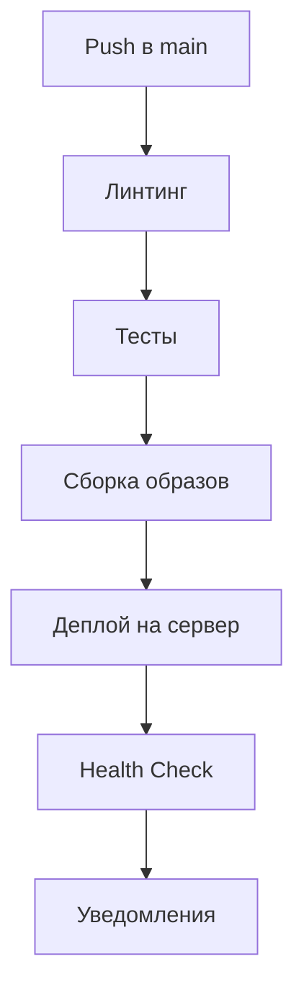

# 🚀 GitHub Actions Deployment Guide

## 📋 Обзор

У нас уже настроен полноценный CI/CD pipeline с автоматическим деплоем на сервер. Вот как это работает:

### 🔄 Workflow'ы

1. **`advanced-ci.yml`** - Основной pipeline с линтингом, тестами, сборкой и деплоем
2. **`release.yml`** - Создание релизов при тегах
3. **`pages.yml`** - Деплой документации на GitHub Pages

## 🎯 Как работает деплой

### Автоматический деплой (main branch)

При каждом push в ветку `main`:

1. ✅ Линтинг и проверки кода
2. 🧪 Запуск тестов
3. 🔒 Сканирование безопасности
4. 🏗️ Сборка Docker образов
5. 🚀 Автоматический деплой на сервер

### Ручной деплой

Можно запустить деплой вручную через GitHub Actions UI.

## 🔧 Настройка сервера

### 1. Подготовка сервера

```bash
# Установка Docker и Docker Compose
curl -fsSL https://get.docker.com -o get-docker.sh
sudo sh get-docker.sh
sudo usermod -aG docker $USER

# Установка Docker Compose
sudo curl -L "https://github.com/docker/compose/releases/latest/download/docker-compose-$(uname -s)-$(uname -m)" -o /usr/local/bin/docker-compose
sudo chmod +x /usr/local/bin/docker-compose
```

### 2. Настройка GitHub Secrets

В настройках репозитория (`Settings` → `Secrets and variables` → `Actions`) добавьте:

| Secret                | Описание                              | Пример                                    |
| --------------------- | ------------------------------------- | ----------------------------------------- |
| `PRODUCTION_APP_DIR`  | Путь к папке с приложением на сервере | `/opt/app`                                |
| `HEALTH_CHECK_URL`    | URL для проверки работоспособности    | `https://parser.mysite.ru/api/v1/health/` |
| `NEXT_PUBLIC_API_URL` | URL API для frontend                  | `https://parser.mysite.ru`                |
| `SLACK_WEBHOOK`       | Webhook для уведомлений в Slack       | `https://hooks.slack.com/...`             |

### 3. Настройка self-hosted runner

Создайте файл `setup-runner.sh`:

```bash
#!/bin/bash

# Создание пользователя для runner
sudo useradd -m -s /bin/bash github-runner
sudo usermod -aG docker github-runner

# Переключение на пользователя
sudo -u github-runner bash << 'EOF'

# Создание папки для runner
mkdir -p ~/actions-runner
cd ~/actions-runner

# Скачивание runner (замените TOKEN на ваш)
curl -o actions-runner-linux-x64-2.311.0.tar.gz -L https://github.com/actions/runner/releases/download/v2.311.0/actions-runner-linux-x64-2.311.0.tar.gz

# Распаковка
tar xzf ./actions-runner-linux-x64-2.311.0.tar.gz

# Настройка (замените TOKEN и URL)
./config.sh --url https://github.com/your-username/your-repo --token TOKEN --labels self-hosted,linux,x64

# Установка как сервис
sudo ./svc.sh install github-runner
sudo ./svc.sh start
EOF
```

## 🚀 Процесс деплоя

### 1. Автоматический деплой



### 2. Ручной деплой

1. Перейдите в `Actions` → `🚀 Продвинутый CI/CD`
2. Нажмите `Run workflow`
3. Выберите ветку и нажмите `Run workflow`

### 3. Деплой через релиз

```bash
# Создание тега
git tag v1.0.0
git push origin v1.0.0
```

## 🔍 Мониторинг деплоя

### Логи в GitHub Actions

- Перейдите в `Actions` → выберите workflow
- Нажмите на job для просмотра логов

### Логи на сервере

```bash
# Логи Docker контейнеров
docker logs fullstack_prod_backend
docker logs fullstack_prod_frontend
docker logs fullstack_prod_nginx

# Логи приложения
tail -f /opt/app/backend/logs/app.log
tail -f /opt/app/nginx/logs/access.log
```

### Health Check

```bash
# Проверка API
curl https://parser.mysite.ru/api/v1/health/

# Проверка frontend
curl https://parser.mysite.ru
```

## 🛠️ Troubleshooting

### Проблемы с деплоем

1. **Ошибка доступа к registry**

   ```bash
   # Проверьте GitHub Token в secrets
   # Убедитесь, что токен имеет права packages:write
   ```

2. **Ошибка подключения к серверу**

   ```bash
   # Проверьте SSH ключи
   # Убедитесь, что runner может подключиться к серверу
   ```

3. **Ошибка Docker**
   ```bash
   # На сервере
   docker system prune -a
   docker volume prune
   ```

### Откат деплоя

```bash
# На сервере
cd /opt/app
docker compose -f docker-compose.prod.ip.yml down
docker compose -f docker-compose.prod.ip.yml up -d --build
```

## 📊 Уведомления

### Slack

Настройте webhook в Slack для получения уведомлений о деплоях.

### Email

Можно добавить email уведомления через GitHub Actions.

## 🔒 Безопасность

### Рекомендации

1. ✅ Используйте сильные секреты
2. ✅ Ограничьте доступ к runner
3. ✅ Регулярно обновляйте зависимости
4. ✅ Мониторьте логи на подозрительную активность

### Ротация секретов

```bash
# Генерация нового секрета
openssl rand -base64 32
```

## 📈 Оптимизация

### Кэширование

- Docker слои кэшируются в GitHub Actions
- Dependencies кэшируются между запусками

### Параллелизация

- Линтинг и тесты запускаются параллельно
- Сборка образов происходит после успешных тестов

## 🎯 Best Practices

1. **Всегда тестируйте перед деплоем**
2. **Используйте feature branches**
3. **Проверяйте health check после деплоя**
4. **Ведите логи всех операций**
5. **Настройте мониторинг**

## 📞 Поддержка

При проблемах:

1. Проверьте логи в GitHub Actions
2. Проверьте логи на сервере
3. Убедитесь в корректности secrets
4. Проверьте доступность сервера

---

**Удачного деплоя! 🚀**
