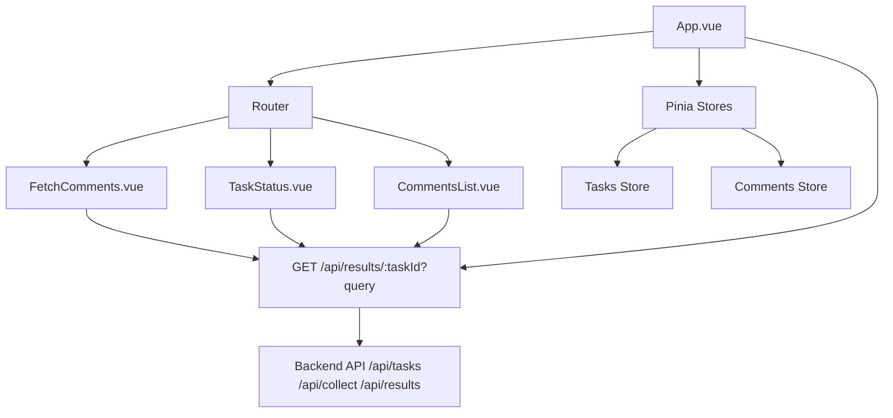

# Техническое задание на реализацию фронтенда для системы анализа VK комментариев

## Обзор проекта и цели фронтенда

### Обзор проекта
Проект представляет собой backend-систему на Node.js с Express (MVC-подобная архитектура: controllers/services/repositories/models), асинхронной обработкой задач через taskService (placeholders для BullMQ с Redis очередями), PostgreSQL для хранения данных и Redis для кэша/токенов/очередей. Backend интегрируется с VK API для сбора комментариев к постам (методы wall.getComments/wall.get), их хранения (морфологический анализ как placeholder для keywords/sentiment). Эндпоинты backend'а:
- `POST /api/tasks`: Создание задачи (body: ownerId (negative для групп), postId, token). Возвращает taskId.
- `POST /api/collect/:taskId`: Запуск сбора комментариев (асинхронно через vkService).
- `GET /api/tasks/:taskId`: Проверка статуса задачи (created/in_progress/completed/failed, progress: {posts, comments}, errors).
- `GET /api/results/:taskId`: Получение результатов (комментарии/посты с query: groupId, postId, limit (default 20), offset, sentiment (placeholder filter)).

Backend доступен по адресу `http://localhost:3000` (через docker-compose). Фронтенд размещен в директории `frontend` и интегрирован с backend через REST API (proxy в Vite на /api -> localhost:3000 для избежания CORS).

### Цели фронтенда
Фронтенд предназначен для визуализации insights из анализа VK комментариев. Основные цели:
- Предоставить удобный интерфейс для ввода параметров (ownerId/postId/token) и запуска задач (create + collect).
- Мониторить статус асинхронных задач в реальном времени (polling).
- Отображать список обработанных комментариев/постов с результатами (текст, автор, дата, likes; placeholders для sentiment/keywords).
- Поддерживать ввод VK access_token (ручной или через frontend OAuth Implicit Flow, хранение в localStorage).
- Поддерживать фильтрацию (groupId/postId/sentiment), пагинацию (limit/offset) и обработку ошибок (rate limit 429, invalid token).
- Сделать интерфейс простым, responsive и на русском языке для аналитиков и разработчиков.

Фронтенд не хранит данные локально (кроме токена в localStorage), полагаясь на backend для операций.
## Архитектура фронтенда

### Структура Vue проекта
Проект на Vue 3 с JavaScript (без TypeScript). Использовать Vite для сборки и разработки. Стандартная структура:
- `src/`
  - `main.js`: Точка входа, инициализация Vue, роутера и Pinia.
  - `App.vue`: Корневой компонент с навигацией (Авторизация/Задачи/Статус/Комментарии) и роутером.
  - `components/`: Общие компоненты (ErrorMessage.vue, LoadingSpinner.vue).
  - `views/`: Страницы (VKAuth.vue опционально, FetchComments.vue, TaskStatus.vue, CommentsList.vue).
  - `router/`: index.js с определением роутов.
  - `stores/`: Pinia для состояния (tasks.js для задач/статуса, comments.js для результатов; без auth-модуля).
  - `services/`: API сервис (api.js с Axios для запросов к backend).
  - `assets/`: Статические ресурсы (CSS, изображения).
- `public/`: Индексный HTML.
- `vite.config.js`: Конфигурация Vite с proxy на backend (`/api` -> `http://localhost:3000`).
- `package.json`: Зависимости и скрипты (bun run dev/build/test).
### Компоненты
- `App.vue`: Основной layout с хедером (навигация: Задачи, Статус, Комментарии) и роутером.
- `VKAuth.vue` (опционально): Кнопка для VK OAuth Implicit Flow (редирект на VK, обработка #access_token в URL, сохранение в localStorage).
- `FetchComments.vue`: Форма с полями (ownerId (negative для групп), postId, token из localStorage/ручной ввод), кнопка создания задачи (POST /api/tasks -> taskId), затем запуска (POST /api/collect/:taskId), отображение taskId.
- `TaskStatus.vue`: Отображение статуса по taskId (polling GET /api/tasks/:taskId каждые 5 сек), индикатор (created/in_progress/completed/failed), progress {posts, comments}, errors.
- `CommentsList.vue`: Таблица результатов (колонки: текст (кликабельный), автор (from_id/name), дата, likes; placeholders для sentiment (positive/neutral/negative, цветовой индикатор), keywords (чипы)), пагинация (limit/offset), фильтры (taskId, groupId/postId, sentiment).

### Роуты (Vue Router)
- `/`: Главная с навигацией (redirect на /fetch если нет задач).
- `/fetch`: FetchComments.vue.
- `/task/:taskId`: TaskStatus.vue.
- `/comments`: CommentsList.vue (query: taskId, groupId, postId, limit, offset, sentiment).

### Состояние (Pinia)
- Модуль `tasks`: taskId, статус, progress, errors, polling методы.
- Модуль `comments`: Список результатов, пагинация, фильтры (без auth-модуля; token в localStorage).

### HTTP клиент (Axios)
- Базовый URL: `/api` (proxy в dev).
- Интерсепторы: Обработка ошибок (429 rate limit - retry, 400/500 - toast), добавление token в body если требуется.
- Методы: postCreateTask(data), postStartCollect(taskId), getTaskStatus(taskId), getResults(taskId, params).
## Требования к функционалу

### Форма для создания и запуска задачи
- Поля: ownerId (number, negative для групп, required), postId (number, positive, required), token (string, из localStorage/ручной ввод, required).
- Валидация: Проверка на пустые/некорректные значения (number для ID, non-empty string для token).
- POST /api/tasks с JSON body -> taskId; затем POST /api/collect/:taskId для запуска (опционально auto-collect после create).
- Успех: Отображение taskId, редирект на /task/:taskId.
- Ошибка: Toast-сообщение (e.g., "Неверный token" для 400, "Rate limit" для 429).

### Мониторинг задачи
- По taskId: GET /api/tasks/:taskId с интервалом 5 сек (setInterval, clear при completed/failed).
- Статусы: Текст (Created, In Progress, Completed, Failed), индикатор/progress {posts, comments}, список errors.
- При завершении: Остановка polling, редирект на /comments?taskId=... .

### Список результатов
- GET /api/results/:taskId с query: groupId (number), postId (number), limit (default 20), offset (0), sentiment (positive/neutral/negative placeholder).
- Таблица: Responsive (горизонтальный скролл на mobile), sortable колонки (text - кликабельный модал для полного, author (from_id/name, ссылка VK если from_id), date, likes; placeholders: sentiment (цвет: зеленый/серый/красный), keywords (чипы/список)).
- Фильтры: Input поиск по text, dropdown sentiment, inputs groupId/postId, кнопки пагинации (prev/next, total count).
- Пустой список: Сообщение "Нет данных для taskId: ...".

### Обработка ошибок
- Сетевые: Retry (3 раза с backoff), toast-уведомления (success/error).
- VK-specific: Rate limit (429 - ждать/retry), invalid token (400 - prompt для нового token).
- Глобально: Vue error boundary, console.log для debug.
## Требования к UI/UX

- **Дизайн**: Минималистичный. Vuetify (Material Design) или Bootstrap для форм/таблиц/кнопок/модалов/toast.
- **Responsive**: Mobile-first layout, таблица с горизонтальным скроллом/collapse на малых экранах.
- **Язык**: Полностью русский (лейблы: "Owner ID", "Post ID", "Token"; ошибки: "Неверный ввод"; i18n опционально).
- **UX**: Спиннеры для loading, toast (Vuetify snackbar) для уведомлений, real-time валидация форм (v-model rules).
- **Доступность**: ARIA-labels для inputs/таблиц, keyboard nav (tabindex), contrast для sentiment colors.

## Технические детали

- **Версия Vue**: Vue 3 (Composition API с <script setup>).
- **Язык**: JavaScript (ES6+).
- **Зависимости** (bun install):
  - vue@^3.4.0
  - vue-router@^4.2.0
  - pinia@^2.1.0
  - axios@^1.6.0
  - vuetify@^3.4.0 (или bootstrap@5)
  - vite@^5.0.0
- **Сборка**: Vite dev (bun run dev на :5173), build (bun run build) в dist/.
- **Интеграция с backend**: Proxy в vite.config.js: server.proxy { '/api': { target: 'http://localhost:3000', changeOrigin: true } } для CORS-free dev.
- **Конфигурация**: .env для VK_APP_ID/REDIRECT_URI (если OAuth в frontend; production - домен с Nginx).
- **Линтинг**: ESLint + Prettier (eslint.config.js, .prettierrc), stylelint для CSS.
## Тестирование

- **Unit-тесты**: Vitest для компонентов (render/props/emits), stores (Pinia actions/getters), services (axios mocks).
  - Покрытие: >80% для ключевых (FetchComments валидация, TaskStatus polling, CommentsList filters).
  - Примеры: Тест postCreateTask mock -> taskId, getTaskStatus mock -> {status: 'completed', progress: {posts: 5}}.
- **E2E-тесты**: Cypress для flows (create task + collect + status + results), mocks API (msw для /api/tasks).
  - Запуск: bun test:e2e (npx cypress open), smoke (успешный flow), edge (400 invalid token, 429 rate limit).
- **Интеграция**: Тесты с backend (docker-compose up), mocks VK API (если OAuth), Vitest coverage report.
## Деплой

- **Сборка**: bun run build генерирует статические файлы в dist/.
- **Интеграция с Nginx**: Сервис в docker-compose.yml (image: nginx:alpine, volumes: ./nginx.conf:/etc/nginx/nginx.conf, ./frontend/dist:/usr/share/nginx/html). Nginx обслуживает frontend, проксирует /api на backend:3000.
- **Конфигурация Nginx**:
  ```
  server {
      listen 80;
      location / {
          root /usr/share/nginx/html;
          try_files $uri $uri/ /index.html;
      }
      location /api {
          proxy_pass http://backend:3000;
          proxy_set_header Host $host;
      }
  }
  ```
- **Production**: Build в CI/CD (GitHub Actions: bun install/build), push Docker images, deploy docker-compose up -d.
- **HTTPS**: Certbot в Nginx или env для SSL (Let's Encrypt).
## Приложения

### Диаграмма компонентов


### Примеры API запросов
- POST /api/tasks: `{ "ownerId": -123, "postId": 456, "token": "vk_access_token" }` → `{ "taskId": 1, "status": "created" }`
- POST /api/collect/1: `{}` → `{ "taskId": 1, "status": "pending" }`
- GET /api/tasks/1: `{ "status": "completed", "progress": { "posts": 5, "comments": 100 }, "errors": [] }`
- GET /api/results/1?limit=20&offset=0&groupId=-123: `{ "results": [ { "id": 1, "text": "Comment", "authorId": 456, "authorName": "User", "date": "2023-...", "likes": 10, "sentiment": "neutral" (placeholder), "keywords": ["key1"] (placeholder) } ], "total": 100 }`

Это ТЗ — основа для реализации frontend. Изменения требуют обновления документа.