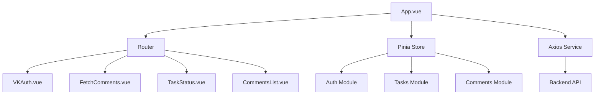

# Техническое задание на реализацию фронтенда для системы анализа VK комментариев

## Обзор проекта и цели фронтенда

### Обзор проекта
Проект представляет собой backend-систему на Go с использованием Clean Architecture, Gin для API, Asynq для асинхронной обработки задач, PostgreSQL для хранения данных и Redis для кэша и очередей. Backend интегрируется с VK API для сбора комментариев к постам (метод wall.getComments), их морфологического анализа (выявление ключевых слов и тональности) и хранения результатов. Эндпоинты backend'а:
- `POST /api/vk/fetch-comments`: Запуск асинхронной задачи по сбору комментариев (параметры: owner_id, post_id, access_token). Возвращает task_id.
- `GET /task/:task_id`: Проверка статуса задачи (pending, processing, completed, failed).
- `GET /api/comments`: Получение списка комментариев с фильтрами (task_id, post_id) и пагинацией.

Backend доступен по адресу `http://localhost:8080` (через docker-compose). Фронтенд будет размещен в директории `frontend` и интегрирован с backend через REST API.

### Цели фронтенда
Фронтенд предназначен для визуализации insights из анализа VK комментариев. Основные цели:
- Предоставить удобный интерфейс для ввода параметров и запуска задач по сбору данных.
- Мониторить статус асинхронных задач в реальном времени.
- Отображать список обработанных комментариев с результатами анализа (текст, автор, тональность (sentiment), ключевые слова (keywords)).
- Обеспечить аутентификацию через VK OAuth для получения access_token.
- Поддерживать фильтрацию, пагинацию и обработку ошибок для улучшения пользовательского опыта.
- Сделать интерфейс простым, responsive и на русском языке для аналитиков и разработчиков.

Фронтенд не будет хранить данные локально (кроме токена в localStorage), а будет полагаться на backend для всех операций.

## Архитектура фронтенда

### Структура Vue проекта
Проект на Vue 3 с JavaScript (без TypeScript). Использовать Vite для сборки и разработки. Стандартная структура:
- `src/`
  - `main.js`: Точка входа, инициализация Vue, роутера и стора.
  - `App.vue`: Корневой компонент с навигацией и роутингом.
  - `components/`: Общие компоненты (например, ErrorMessage.vue, LoadingSpinner.vue).
  - `views/`: Страницы (VKAuth.vue, FetchComments.vue, TaskStatus.vue, CommentsList.vue).
  - `router/`: index.js с определением роутов.
  - `stores/`: Pinia для управления состоянием (store.js с модулями для auth, tasks, comments).
  - `services/`: API сервис (api.js с Axios для запросов к backend).
  - `assets/`: Статические ресурсы (CSS, изображения).
- `public/`: Индексный HTML.
- `vite.config.js`: Конфигурация Vite с proxy на backend (`/api` -> `http://localhost:8080`).
- `package.json`: Зависимости и скрипты (dev, build, test).

### Компоненты
- `App.vue`: Основной layout с хедером (навигация: Авторизация, Запуск задачи, Статус, Комментарии) и роутером.
- `VKAuth.vue`: Кнопка для VK OAuth Implicit Flow (редирект на VK, обработка #access_token в URL, сохранение в localStorage).
- `FetchComments.vue`: Форма с полями (owner_id, post_id, access_token из localStorage или ручной ввод), кнопка отправки POST-запроса, отображение task_id.
- `TaskStatus.vue`: Отображение статуса по task_id (polling каждые 5 сек), прогресс-бар или индикатор (pending/processing/completed/failed).
- `CommentsList.vue`: Таблица комментариев (колонки: текст, автор, дата, sentiment (positive/neutral/negative), keywords (список)), пагинация (limit/offset), фильтры (по task_id, post_id, sentiment).

### Роуты (Vue Router)
- `/`: Главная страница с навигацией (redirect на /auth если нет токена).
- `/auth`: VKAuth.vue.
- `/fetch`: FetchComments.vue.
- `/task/:task_id`: TaskStatus.vue.
- `/comments`: CommentsList.vue (с query-параметрами для фильтров).

### Состояние (Pinia)
- Модуль `auth`: Хранение access_token, методы login/logout.
- Модуль `tasks`: task_id, статус, polling.
- Модуль `comments`: Список комментариев, пагинация, фильтры.

### HTTP клиент (Axios)
- Базовый URL: `/api` (proxy в dev).
- Интерсепторы: Добавление токена в headers если нужно, обработка ошибок (401 - редирект на auth).
- Методы: postFetchComments(data), getTaskStatus(taskId), getComments(params).

## Требования к функционалу

### Форма для fetch-comments
- Поля: owner_id (number, required), post_id (number, required), access_token (string, из localStorage или ручной ввод).
- Валидация: Проверка на пустые поля, числовые значения.
- POST-запрос на `/api/vk/fetch-comments` с JSON body.
- Успех: Отображение task_id, редирект на /task/:task_id.
- Ошибка: Показ сообщения (например, "Неверный токен").

### Мониторинг задачи
- По task_id: GET-запросы на `/task/:task_id` с интервалом 5 сек (setInterval, clear при завершении).
- Статусы: Отображение текста (Ожидание, Обработка, Завершено, Ошибка), прогресс (если backend возвращает %).
- При завершении: Редирект на /comments?task_id=... или остановка polling.

### Список комментариев
- GET-запрос на `/api/comments` с query-параметрами: task_id, post_id, limit (default 20), offset (для пагинации), sentiment (filter).
- Таблица: Responsive, sortable колонки (text - кликабельный для полного текста, author - ссылка на профиль VK если возможно, sentiment - цветовой индикатор (зеленый/серый/красный), keywords - чипы/список).
- Фильтры: Dropdown для sentiment, input для поиска по text, кнопки пагинации (предыдущая/следующая).
- Пустой список: Сообщение "Нет данных".

### Обработка ошибок
- Сетевые ошибки: Retry (3 раза), показ toast-уведомлений.
- VK-specific: Rate limit (ждать и retry), invalid token (редирект на auth).
- Глобально: Error boundary в Vue, логи в console.

## Требования к UI/UX

- **Дизайн**: Простой и минималистичный. Использовать Vuetify (Material Design) или Bootstrap для компонентов (формы, таблицы, кнопки, модалы).
- **Responsive**: Адаптивный layout (mobile-first), таблица с горизонтальным скроллом на малых экранах.
- **Язык**: Полностью на русском (тексты кнопок, лейблы, ошибки). Использовать i18n если планируется расширение.
- **UX**: Загрузочные спиннеры, toast для уведомлений (успех/ошибка), валидация форм в реальном времени.
- **Доступность**: ARIA-атрибуты для форм и таблиц, клавиатурная навигация.

## Технические детали

- **Версия Vue**: Vue 3 (Composition API где возможно).
- **Язык**: JavaScript (ES6+).
- **Зависимости** (bun или yarn):
  - vue@^3.4.0
  - vue-router@^4.2.0
  - pinia@^2.1.0
  - axios@^1.6.0
  - vuetify@^3.4.0 (или bootstrap-vue-3)
  - vite@^5.0.0
- **Сборка**: Vite для dev-сервера (bun run dev), production build (bun run build) в dist/.
- **Интеграция с backend**: Proxy в vite.config.js: server.proxy { '/api': 'http://localhost:8080' } для избежания CORS в dev.
- **Конфигурация**: .env для VK_APP_ID, REDIRECT_URI (в production - домен с Nginx).
- **Линтинг**: ESLint + Prettier для JS, stylelint для CSS.

## Тестирование

- **Unit-тесты**: Vitest для компонентов (тесты рендера, props, emits), сторов (Pinia), сервисов (Axios mocks).
  - Покрытие: >80% для ключевых компонентов.
  - Примеры: Тест формы FetchComments на валидацию, тест polling в TaskStatus.
- **E2E-тесты**: Cypress для сценариев (аутентификация, запуск задачи, просмотр списка).
  - Запуск: npx cypress open, тесты на smoke (успешный флоу) и edge-cases (ошибки).
- **Интеграция**: Тесты с запущенным backend (docker-compose up), mocks для VK OAuth.

## Деплой

- **Сборка**: bun run build` генерирует статические файлы в dist/.
- **Интеграция с Nginx**: Добавить сервис в docker-compose.yml (image: nginx:alpine, volume: ./nginx/nginx.conf:/etc/nginx/nginx.conf, ./frontend/dist:/usr/share/nginx/html). Nginx проксирует /api на backend:8080, обслуживает статіку.
- **Конфигурация Nginx**: 
  ```
  server {
      listen 80;
      location / {
          root /usr/share/nginx/html;
          try_files $uri $uri/ /index.html;
      }
      location /api {
          proxy_pass http://backend:8080;
      }
  }
  ```
- **Production**: Build в CI/CD (GitHub Actions), push образов в registry, deploy с docker-compose up -d.
- **HTTPS**: Добавить certbot или env для SSL в production.

## Приложения

### Диаграмма компонентов


### Примеры API запросов
- POST /api/vk/fetch-comments: `{ "owner_id": -123, "post_id": 456, "access_token": "token" }` → `{ "task_id": "uuid" }`
- GET /task/uuid: `{ "status": "completed", "progress": 100 }`
- GET /api/comments?task_id=uuid&limit=20&offset=0: `{ "comments": [...], "total": 100 }`

Это ТЗ является основой для реализации. Любые изменения требуют обновления документа.