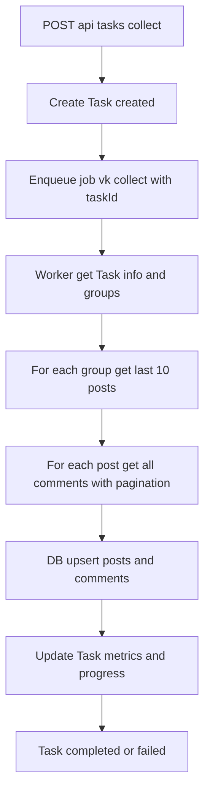

# Prompt: Реализовать основную логику VK сборщика на backend

Цель
- Подключиться к VK API по access_token
- Получить список групп из источника (БД), пройтись по 10 последним постам каждой группы
- Собрать все комментарии с этих постов (включая пагинацию)
- Сохранить посты и комментарии в БД с идемпотентностью и прогрессом задачи

Контекст кода
- VK клиент: [backend/src/repositories/vkApi.js](backend/src/repositories/vkApi.js)
- Сервис оркестрации задачи: [backend/src/services/vkService.js](backend/src/services/vkService.js)
- Работа с задачами: [backend/src/services/taskService.js](backend/src/services/taskService.js)
- Репозиторий БД: [backend/src/repositories/dbRepo.js](backend/src/repositories/dbRepo.js)
- Очередь BullMQ: [backend/config/queue.js](backend/config/queue.js)
- Модели: [backend/src/models/post.js](backend/src/models/post.js), [backend/src/models/comment.js](backend/src/models/comment.js), [backend/src/models/task.js](backend/src/models/task.js)
- Группы: [backend/src/repositories/groupsRepo.js](backend/src/repositories/groupsRepo.js)

Важные наблюдения и несоответствия, которые нужно учесть и исправить
1) Несогласованные интерфейсы vkApi и vkService:
   - vkService на строках ожидает, что vkApi.getPosts вернет объект с полем items и посты в формате raw VK API, но vkApi.getPosts возвращает { posts } и уже маппит поля.
   - vkService ожидает, что vkApi.getComments вернет объект с полем items, но vkApi.getComments возвращает { comments, hasMore } и уже маппит поля.
   Требуется унификация: либо vkApi всегда возвращает нормализованные объекты posts и comments (рекомендуется), либо vkService не делает повторной нормализации и работает с тем, что отдает vkApi.

2) Знак owner_id для групп:
   - vkApi.getPosts принимает groupId и сам переводит в owner_id = -groupId.
   - vkService передает -groupId в vkApi.getPosts и getComments, получая в итоге двойное отрицание. Нужно единообразие: во всех вызовах в сервисах передавать groupId без знака, а преобразование в owner_id = -groupId делать исключительно внутри vkApi.

3) Модели БД и первичные ключи:
   - Модели Post и Comment сейчас используют autoIncrement id. При этом в коде используются VK id (post.id, comment.id) как если бы это были наши PK, что приведет к конфликтам с автоинкрементами и отсутствию идемпотентности.
   Рекомендуется:
   - В таблицу posts добавить vk_post_id (UNIQUE), owner_id (owner_id VK), group_id, текст, likes, дата.
   - В таблицу comments добавить vk_comment_id (UNIQUE), post_vk_id и owner_id, author_id, author_name, текст, likes, дата.
   - Использовать upsert по vk_post_id и vk_comment_id.
   - Наш внутренний id может оставаться автоинкрементным, но вся идемпотентность строится на vk_* полях.

4) Идемпотентность и повторные запуски:
   - Должны быть уникальные индексы и upsert, чтобы повторные запуски не создавали дубликаты.

5) Прогресс и статус задачи:
   - В Task.metrics хранить posts, comments, errors, и обновлять по мере выполнения.
   - Статусы: created -> in_progress -> completed или failed, с startedAt/finishedAt.

6) Ограничения VK API:
   - Учитывать rate limit 3 req/s (в vkApi уже есть RateLimiterMemory).
   - Ретраи с экспоненциальной задержкой (axios-retry уже подключен). Обрабатывать 429 и 5xx.

7) Очередь:
   - В проекте уже есть [backend/config/queue.js](backend/config/queue.js) с очередью vk-collect и воркером. Нужно использовать ее для фонового запуска задач.

Требования к реализации

1. Унификация VK API клиента
- Привести vkApi к единому контракту:
  - getPosts(groupId: number): Promise<{ posts: Array<NormalizedPost> }>
    - groupId всегда положительный
    - NormalizedPost: { vk_post_id, owner_id, group_id, text, date, likes }
  - getComments(groupId: number, postVkId: number): Promise<{ comments: Array<NormalizedComment>, hasMore: boolean }>
    - groupId всегда положительный
    - NormalizedComment: { vk_comment_id, post_vk_id, owner_id, author_id, author_name, text, date, likes }
  - Вся логика owner_id = -groupId внутри vkApi.
  - Пагинация в getComments: собирать все страницы по 100, пока есть данные. Текущая логика с offset работает — сохранить, но возвращать только нормализованные comments (без VK сырья).
- Строго логировать ошибки VK, коды и сообщения. На ошибках VK API кидать понятные исключения.

2. Нормализация моделей и репозитория БД
- Обновить модели и миграции, чтобы поддерживать vk_post_id и vk_comment_id:
  - posts: id (PK, auto), vk_post_id (UNIQUE), owner_id, group_id, text, likes, date, task_id (FK), created_at, updated_at.
  - comments: id (PK, auto), vk_comment_id (UNIQUE), post_vk_id, owner_id, author_id, author_name, text, likes, date, created_at, updated_at.
- В dbRepo:
  - Добавить методы upsertPosts(taskId, posts) и upsertComments(postVkId, comments) с bulkCreate({ updateOnDuplicate: [...] }).
  - createTask, getTaskById, updateTask — оставить, но убедиться, что metrics можно безопасно обновлять инкрементально.
  - getResults(taskId, ...) — вернуть агрегированные результаты с учетом связи по vk_post_id, если потребуется.

3. Сервисная логика оркестрации
- В vkService.collectForTask(taskId, groups):
  - Перевести groups в список числовых groupId положительного знака.
  - Для каждой группы:
    - Вызвать vkApi.getPosts(groupId) и взять первые 10 постов (если VK вернул больше).
    - Для каждого поста получить все комментарии через vkApi.getComments(groupId, post.vk_post_id) с пагинацией.
    - Сохранить посты upsert-ом, затем комментарии upsert-ом.
    - Вести счетчики groupPosts, groupComments, обновлять totals.
  - По окончании записать metrics и статус (completed если нет ошибок, иначе failed), фиксируя ошибки массивом строк.
  - Прогресс: обновлять Task.metrics периодически (например, после каждой группы) для UI.

4. Интеграция с очередью
- Использовать [backend/config/queue.js](backend/config/queue.js) для фонового старта:
  - POST /api/tasks/collect создает задачу (status created), кладет job в очередь с taskId.
  - В воркере доставать taskId и вызывать vkService.collectForTask.
  - Конкурентность 1-3, чтобы не нарушать rate limit. Можно масштабировать воркеры позже.

5. Источник списка групп
- Использовать [backend/src/repositories/groupsRepo.js](backend/src/repositories/groupsRepo.js) при необходимости (если нужно брать набор групп из БД).
- На первом этапе — принимать groups в теле запроса или брать из tasks.groups, если это уже заложено. Привести к единому формату массива чисел.

6. Обработка вложенных комментариев
- Если нужно собирать threads, зафиксируйте стратегию:
  - Сейчас достаточно основного уровня комментариев.
  - Если требуется threads, расширить NormalizedComment полями thread_count и parent_id, плюс возможный второй проход по threads.items.

7. Обработка ошибок
- Любая VK ошибка для конкретной группы не должна останавливать всю задачу — логировать и продолжать остальные группы.
- На общую фатальную ошибку — статус failed и запись в metrics.errors.

8. Критерии производительности и лимитов
- Соблюдать 3 req/s за счет уже существующего rate limiter в vkApi.
- Параметры таймаутов VK запроса: 10s достаточно, ретраи 3 с экспоненциальной задержкой.

9. Тестирование
- Unit:
  - Мокнуть vkApi, тестировать vkService.collectForTask — корректный подсчет totals, сохранение upsert, обработка ошибок, идемпотентность.
  - Тесты на dbRepo upsert с уникальными vk_*.
- Integration:
  - Эндпоинт старта задачи и статуса через очередь.
  - Маленькая фикстура групп и постов.
- Нагрузочные мини-тесты: 2-3 группы, 10 постов, по 200-500 комментариев суммарно.

Схема потока

Необходимые изменения по файлам
- VK API клиент:
  - Привести контракт и нормализацию в [backend/src/repositories/vkApi.js](backend/src/repositories/vkApi.js).
- Сервис:
  - Исправить оркестрацию и использование vkApi в [backend/src/services/vkService.js](backend/src/services/vkService.js).
- Репозиторий БД:
  - Добавить upsert методы в [backend/src/repositories/dbRepo.js](backend/src/repositories/dbRepo.js).
- Модели и миграции:
  - Добавить vk_post_id, vk_comment_id и индексы в [backend/src/models/post.js](backend/src/models/post.js) и [backend/src/models/comment.js](backend/src/models/comment.js), плюс миграции.
- Очередь:
  - Убедиться, что старт задач идет через [backend/config/queue.js](backend/config/queue.js), воркер вызывает collectForTask.

Acceptance Criteria
- POST /api/tasks/collect возвращает taskId и стартует фоновую задачу через очередь.
- Для каждой указанной или хранимой группы собираются ровно 10 последних постов (если их меньше, то сколько есть).
- Для каждого поста собираются все комментарии с учетом пагинации.
- Все посты и комментарии сохраняются в БД без дублей за счет vk_post_id и vk_comment_id (upsert).
- Прогресс задачи и итоговые метрики отражаются в Task.metrics: posts, comments, errors.
- При ошибках VK по отдельной группе задача продолжает выполняться для остальных групп; итоговый статус completed если ошибок нет, иначе failed.
- Соблюдение rate limit 3 req/s и ретраи с экспоненциальной задержкой.
- Unit и интеграционные тесты зеленые.

Замечания по обратной совместимости
- Если фронт уже ожидает определенный формат данных и метрик, сохраняйте контракт API стабильно. Любые изменения моделей — через миграции и адаптацию dbRepo.
- Временно допускается сопоставление старых полей с новыми vk_* в репозитории, но лучше сразу перейти на явные vk_post_id и vk_comment_id.

Подсказки по реализации upsert в Sequelize
- Для bulkCreate используйте опцию updateOnDuplicate с перечислением полей, которые обновляются при конфликте UNIQUE (vk_post_id или vk_comment_id).
- Создайте уникальные индексы на vk_post_id и vk_comment_id в миграциях.
- Пример полей для updateOnDuplicate у posts: [text, likes, date, owner_id, group_id, updatedAt].
- Для comments: [text, likes, date, author_id, author_name, updatedAt].

Проверочный чек-лист перед сдачей
- Контракт vkApi единообразен, vkService не пере-нормализует данные.
- Все owner_id формируются внутри vkApi из положительного groupId.
- Модели и миграции созданы, UNIQUE индексы на vk_post_id и vk_comment_id есть.
- dbRepo использует upsert для постов и комментариев.
- Очередь BullMQ запускает collectForTask по taskId.
- Тесты покрывают happy path и частичные ошибки VK.
- Логирование ошибок и прогресса включено.