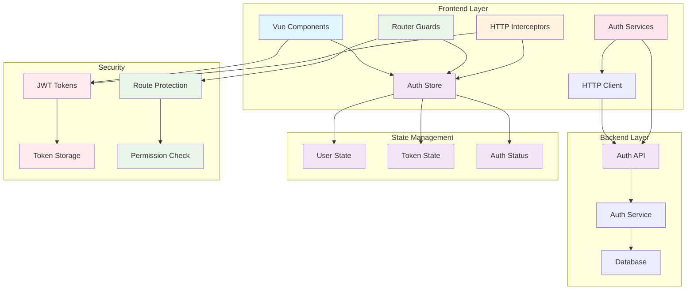

# Архитектура системы аутентификации для Vue.js фронтенда

## Обзор

Данная архитектура описывает полную систему аутентификации для Vue.js приложения на основе проанализированного API бэкенда. Система построена с использованием Vue 3 Composition API, Pinia для управления состоянием и TypeScript для типизации.

## 1. Диаграмма архитектуры компонентов



## 2. Структура файлов и папок

```
frontend/src/
├── auth/
│   ├── components/
│   │   ├── LoginForm.vue
│   │   ├── RegisterForm.vue
│   │   ├── ChangePasswordForm.vue
│   │   ├── ResetPasswordForm.vue
│   │   └── LogoutButton.vue
│   ├── composables/
│   │   ├── useAuth.ts
│   │   └── useAuthGuard.ts
│   ├── services/
│   │   ├── auth.service.ts
│   │   └── auth.interceptors.ts
│   ├── stores/
│   │   └── auth.store.ts
│   ├── types/
│   │   ├── auth.types.ts
│   │   └── api.types.ts
│   ├── utils/
│   │   ├── token.utils.ts
│   │   └── validation.utils.ts
│   ├── guards/
│   │   └── auth.guard.ts
│   └── index.ts
├── router/
│   ├── guards/
│   │   └── index.ts
│   └── index.ts
└── types/
    └── global.d.ts
```

## 3. Интерфейсы и типы TypeScript

### 3.1 Основные типы аутентификации

```typescript
// frontend/src/auth/types/auth.types.ts
export interface User {
  id: string;
  email: string;
  full_name: string;
  created_at: string;
  updated_at: string;
  is_active: boolean;
}

export interface AuthTokens {
  access_token: string;
  refresh_token: string;
  token_type: string;
  expires_in: number;
}

export interface AuthState {
  user: User | null;
  tokens: AuthTokens | null;
  isAuthenticated: boolean;
  isLoading: boolean;
  error: string | null;
}

export enum AuthErrorType {
  INVALID_CREDENTIALS = 'INVALID_CREDENTIALS',
  TOKEN_EXPIRED = 'TOKEN_EXPIRED',
  NETWORK_ERROR = 'NETWORK_ERROR',
  VALIDATION_ERROR = 'VALIDATION_ERROR',
  UNAUTHORIZED = 'UNAUTHORIZED'
}
```

### 3.2 API типы

```typescript
// frontend/src/auth/types/api.types.ts
export interface LoginRequest {
  email: string;
  password: string;
}

export interface LoginResponse {
  access_token: string;
  refresh_token: string;
  token_type: string;
  expires_in: number;
  user: User;
}

export interface RegisterRequest {
  email: string;
  password: string;
  full_name: string;
}

export interface RegisterResponse extends LoginResponse {}

export interface RefreshTokenRequest {
  refresh_token: string;
}

export interface RefreshTokenResponse {
  access_token: string;
  token_type: string;
  expires_in: number;
}

export interface ChangePasswordRequest {
  current_password: string;
  new_password: string;
}

export interface ResetPasswordRequest {
  email: string;
}

export interface ResetPasswordConfirmRequest {
  token: string;
  new_password: string;
}

export interface LogoutRequest {
  refresh_token?: string;
}

export interface ApiError {
  detail: string;
  code?: string;
  field?: string;
}
```

## 4. API сервисы и методы

### 4.1 HTTP клиент с перехватчиками

```typescript
// frontend/src/auth/services/auth.interceptors.ts
import axios, { AxiosInstance, AxiosResponse } from 'axios';

class AuthInterceptor {
  private api: AxiosInstance;

  constructor() {
    this.api = axios.create({
      baseURL: import.meta.env.VITE_API_BASE_URL || '/api',
      timeout: 10000,
    });

    this.setupInterceptors();
  }

  private setupInterceptors(): void {
    // Request interceptor для добавления токена
    this.api.interceptors.request.use(
      (config) => {
        const tokens = this.getStoredTokens();
        if (tokens?.access_token) {
          config.headers.Authorization = `Bearer ${tokens.access_token}`;
        }
        return config;
      },
      (error) => Promise.reject(error)
    );

    // Response interceptor для обработки ошибок и обновления токенов
    this.api.interceptors.response.use(
      (response: AxiosResponse) => response,
      async (error) => {
        const originalRequest = error.config;

        if (error.response?.status === 401 && !originalRequest._retry) {
          originalRequest._retry = true;
          return this.handleTokenRefresh(originalRequest);
        }

        return Promise.reject(this.transformError(error));
      }
    );
  }

  private async handleTokenRefresh(originalRequest: any): Promise<any> {
    try {
      const tokens = this.getStoredTokens();
      if (!tokens?.refresh_token) {
        throw new Error('No refresh token available');
      }

      const response = await this.api.post('/auth/refresh', {
        refresh_token: tokens.refresh_token,
      });

      const newTokens = response.data;
      this.storeTokens(newTokens);

      // Повторяем оригинальный запрос с новым токеном
      originalRequest.headers.Authorization = `Bearer ${newTokens.access_token}`;
      return this.api(originalRequest);
    } catch (error) {
      this.clearTokens();
      window.location.href = '/login';
      return Promise.reject(error);
    }
  }

  private transformError(error: any): AuthError {
    // Преобразование ошибок API в стандартизированный формат
    return {
      type: AuthErrorType.NETWORK_ERROR,
      message: error.response?.data?.detail || error.message,
      status: error.response?.status,
    };
  }

  // Методы для работы с токенами
  private getStoredTokens(): AuthTokens | null {
    // Реализация получения токенов из localStorage/sessionStorage
  }

  private storeTokens(tokens: AuthTokens): void {
    // Реализация сохранения токенов
  }

  private clearTokens(): void {
    // Реализация очистки токенов
  }
}

export const authInterceptor = new AuthInterceptor();
```

### 4.2 Сервис аутентификации

```typescript
// frontend/src/auth/services/auth.service.ts
import { authInterceptor } from './auth.interceptors';
import type {
  LoginRequest,
  LoginResponse,
  RegisterRequest,
  RegisterResponse,
  RefreshTokenRequest,
  RefreshTokenResponse,
  ChangePasswordRequest,
  ResetPasswordRequest,
  ResetPasswordConfirmRequest,
  LogoutRequest,
  User,
} from '../types';

export class AuthService {
  async login(credentials: LoginRequest): Promise<LoginResponse> {
    const response = await authInterceptor.api.post('/auth/login', credentials);
    return response.data;
  }

  async register(userData: RegisterRequest): Promise<RegisterResponse> {
    const response = await authInterceptor.api.post('/auth/register', userData);
    return response.data;
  }

  async refreshToken(tokens: RefreshTokenRequest): Promise<RefreshTokenResponse> {
    const response = await authInterceptor.api.post('/auth/refresh', tokens);
    return response.data;
  }

  async changePassword(data: ChangePasswordRequest): Promise<void> {
    await authInterceptor.api.post('/auth/change-password', data);
  }

  async resetPassword(email: ResetPasswordRequest): Promise<void> {
    await authInterceptor.api.post('/auth/reset-password', email);
  }

  async resetPasswordConfirm(data: ResetPasswordConfirmRequest): Promise<void> {
    await authInterceptor.api.post('/auth/reset-password-confirm', data);
  }

  async logout(data?: LogoutRequest): Promise<void> {
    await authInterceptor.api.post('/auth/logout', data || {});
  }

  async getCurrentUser(): Promise<User> {
    const response = await authInterceptor.api.get('/auth/me');
    return response.data;
  }

  async validateToken(): Promise<boolean> {
    try {
      await this.getCurrentUser();
      return true;
    } catch {
      return false;
    }
  }
}

export const authService = new AuthService();
```

## 5. Хранилище состояния (Pinia store)

```typescript
// frontend/src/auth/stores/auth.store.ts
import { defineStore } from 'pinia';
import { ref, computed } from 'vue';
import { authService } from '../services/auth.service';
import type { AuthState, User, AuthTokens, AuthError } from '../types';

export const useAuthStore = defineStore('auth', () => {
  // Состояние
  const user = ref<User | null>(null);
  const tokens = ref<AuthTokens | null>(null);
  const isLoading = ref(false);
  const error = ref<AuthError | null>(null);

  // Вычисляемые свойства
  const isAuthenticated = computed(() => {
    return !!(user.value && tokens.value?.access_token);
  });

  const userDisplayName = computed(() => {
    return user.value?.full_name || user.value?.email || 'Пользователь';
  });

  const tokenExpiresAt = computed(() => {
    if (!tokens.value?.expires_in) return null;
    return Date.now() + (tokens.value.expires_in * 1000);
  });

  // Действия
  async function login(email: string, password: string) {
    isLoading.value = true;
    error.value = null;

    try {
      const response = await authService.login({ email, password });

      user.value = response.user;
      tokens.value = {
        access_token: response.access_token,
        refresh_token: response.refresh_token,
        token_type: response.token_type,
        expires_in: response.expires_in,
      };

      // Сохраняем токены в localStorage
      localStorage.setItem('auth_tokens', JSON.stringify(tokens.value));

      return response;
    } catch (err: any) {
      error.value = {
        type: 'INVALID_CREDENTIALS',
        message: err.message || 'Ошибка входа в систему',
      };
      throw err;
    } finally {
      isLoading.value = false;
    }
  }

  async function register(email: string, password: string, fullName: string) {
    isLoading.value = true;
    error.value = null;

    try {
      const response = await authService.register({ email, password, full_name: fullName });

      user.value = response.user;
      tokens.value = {
        access_token: response.access_token,
        refresh_token: response.refresh_token,
        token_type: response.token_type,
        expires_in: response.expires_in,
      };

      localStorage.setItem('auth_tokens', JSON.stringify(tokens.value));

      return response;
    } catch (err: any) {
      error.value = {
        type: 'VALIDATION_ERROR',
        message: err.message || 'Ошибка регистрации',
      };
      throw err;
    } finally {
      isLoading.value = false;
    }
  }

  async function logout() {
    if (tokens.value?.refresh_token) {
      try {
        await authService.logout({ refresh_token: tokens.value.refresh_token });
      } catch {
        // Игнорируем ошибки при выходе
      }
    }

    // Очищаем состояние
    user.value = null;
    tokens.value = null;
    error.value = null;
    localStorage.removeItem('auth_tokens');
  }

  async function refreshTokens() {
    if (!tokens.value?.refresh_token) {
      throw new Error('No refresh token available');
    }

    try {
      const response = await authService.refreshToken({
        refresh_token: tokens.value.refresh_token,
      });

      tokens.value = {
        access_token: response.access_token,
        refresh_token: tokens.value.refresh_token, // refresh token остается тем же
        token_type: response.token_type,
        expires_in: response.expires_in,
      };

      localStorage.setItem('auth_tokens', JSON.stringify(tokens.value));
    } catch (err: any) {
      await logout();
      throw err;
    }
  }

  async function loadUserFromStorage() {
    const storedTokens = localStorage.getItem('auth_tokens');
    if (!storedTokens) return;

    try {
      const parsedTokens: AuthTokens = JSON.parse(storedTokens);
      tokens.value = parsedTokens;

      // Проверяем валидность токена
      const isValid = await authService.validateToken();
      if (isValid) {
        user.value = await authService.getCurrentUser();
      } else {
        localStorage.removeItem('auth_tokens');
      }
    } catch {
      localStorage.removeItem('auth_tokens');
    }
  }

  function clearError() {
    error.value = null;
  }

  // Возвращаем reactive состояние и методы
  return {
    // Состояние
    user: readonly(user),
    tokens: readonly(tokens),
    isLoading: readonly(isLoading),
    error: readonly(error),

    // Вычисляемые
    isAuthenticated,
    userDisplayName,
    tokenExpiresAt,

    // Действия
    login,
    register,
    logout,
    refreshTokens,
    loadUserFromStorage,
    clearError,
  };
});
```

## 6. Guards для защиты роутов

```typescript
// frontend/src/auth/guards/auth.guard.ts
import type { NavigationGuardNext, RouteLocationNormalized } from 'vue-router';
import { useAuthStore } from '../stores/auth.store';

export interface AuthGuardOptions {
  requiresAuth?: boolean;
  redirectTo?: string;
  roles?: string[];
}

export function createAuthGuard(options: AuthGuardOptions = {}) {
  const {
    requiresAuth = true,
    redirectTo = '/login',
    roles = [],
  } = options;

  return async (
    to: RouteLocationNormalized,
    from: RouteLocationNormalized,
    next: NavigationGuardNext
  ) => {
    const authStore = useAuthStore();

    // Если требуется аутентификация
    if (requiresAuth) {
      // Проверяем, загружено ли состояние пользователя
      if (!authStore.user && !authStore.tokens) {
        await authStore.loadUserFromStorage();
      }

      // Если пользователь не аутентифицирован
      if (!authStore.isAuthenticated) {
        return next({
          path: redirectTo,
          query: { redirect: to.fullPath },
        });
      }

      // Проверяем роли пользователя
      if (roles.length > 0 && authStore.user) {
        const userRole = authStore.user.role;
        if (!roles.includes(userRole)) {
          return next({ path: '/unauthorized' });
        }
      }
    } else {
      // Если аутентификация не требуется, но пользователь уже вошел
      if (authStore.isAuthenticated && to.path === '/login') {
        return next({ path: '/' });
      }
    }

    next();
  };
}

// Предустановленные guards
export const requireAuth = createAuthGuard({ requiresAuth: true });
export const guestOnly = createAuthGuard({ requiresAuth: false });
export const requireRole = (roles: string[]) =>
  createAuthGuard({ requiresAuth: true, roles });
```

## 7. Middleware для обновления токенов

```typescript
// frontend/src/auth/utils/token.utils.ts
import { useAuthStore } from '../stores/auth.store';

export class TokenManager {
  private refreshTimer: NodeJS.Timeout | null = null;
  private readonly REFRESH_THRESHOLD = 5 * 60 * 1000; // 5 минут

  startTokenRefreshTimer(): void {
    const authStore = useAuthStore();

    if (this.refreshTimer) {
      clearTimeout(this.refreshTimer);
    }

    const expiresAt = authStore.tokenExpiresAt;
    if (!expiresAt) return;

    const timeUntilRefresh = expiresAt - Date.now() - this.REFRESH_THRESHOLD;

    if (timeUntilRefresh > 0) {
      this.refreshTimer = setTimeout(async () => {
        try {
          await authStore.refreshTokens();
          this.startTokenRefreshTimer(); // Перезапускаем таймер
        } catch (error) {
          console.error('Failed to refresh token:', error);
        }
      }, timeUntilRefresh);
    }
  }

  stopTokenRefreshTimer(): void {
    if (this.refreshTimer) {
      clearTimeout(this.refreshTimer);
      this.refreshTimer = null;
    }
  }

  isTokenExpiringSoon(): boolean {
    const authStore = useAuthStore();
    const expiresAt = authStore.tokenExpiresAt;

    if (!expiresAt) return false;

    return (expiresAt - Date.now()) < this.REFRESH_THRESHOLD;
  }
}

export const tokenManager = new TokenManager();
```

## 8. Компоненты форм аутентификации

### 8.1 Компонент формы входа

```typescript
// frontend/src/auth/components/LoginForm.vue
<template>
  <form @submit.prevent="handleSubmit" class="auth-form">
    <div class="form-group">
      <label for="email">Email</label>
      <input
        id="email"
        v-model="form.email"
        type="email"
        required
        :disabled="isLoading"
      />
    </div>

    <div class="form-group">
      <label for="password">Пароль</label>
      <input
        id="password"
        v-model="form.password"
        type="password"
        required
        :disabled="isLoading"
      />
    </div>

    <button type="submit" :disabled="isLoading" class="btn-primary">
      {{ isLoading ? 'Вход...' : 'Войти' }}
    </button>

    <div v-if="error" class="error-message">
      {{ error.message }}
    </div>

    <div class="auth-links">
      <router-link to="/register">Регистрация</router-link>
      <router-link to="/reset-password">Забыли пароль?</router-link>
    </div>
  </form>
</template>

<script setup lang="ts">
import { ref, reactive } from 'vue';
import { useRouter, useRoute } from 'vue-router';
import { useAuthStore } from '../stores/auth.store';

interface LoginFormData {
  email: string;
  password: string;
}

const router = useRouter();
const route = useRoute();
const authStore = useAuthStore();

const isLoading = ref(false);
const form = reactive<LoginFormData>({
  email: '',
  password: '',
});

const error = ref<{ message: string } | null>(null);

async function handleSubmit() {
  if (!form.email || !form.password) return;

  isLoading.value = true;
  error.value = null;

  try {
    await authStore.login(form.email, form.password);

    // Перенаправляем на защищенную страницу или главную
    const redirectTo = (route.query.redirect as string) || '/';
    await router.push(redirectTo);
  } catch (err: any) {
    error.value = {
      message: err.message || 'Ошибка входа в систему',
    };
  } finally {
    isLoading.value = false;
  }
}
</script>
```

### 8.2 Компонент формы регистрации

```typescript
// frontend/src/auth/components/RegisterForm.vue
<template>
  <form @submit.prevent="handleSubmit" class="auth-form">
    <div class="form-group">
      <label for="fullName">Полное имя</label>
      <input
        id="fullName"
        v-model="form.fullName"
        type="text"
        required
        :disabled="isLoading"
      />
    </div>

    <div class="form-group">
      <label for="email">Email</label>
      <input
        id="email"
        v-model="form.email"
        type="email"
        required
        :disabled="isLoading"
      />
    </div>

    <div class="form-group">
      <label for="password">Пароль</label>
      <input
        id="password"
        v-model="form.password"
        type="password"
        required
        minlength="8"
        :disabled="isLoading"
      />
    </div>

    <div class="form-group">
      <label for="confirmPassword">Подтвердите пароль</label>
      <input
        id="confirmPassword"
        v-model="form.confirmPassword"
        type="password"
        required
        :disabled="isLoading"
      />
    </div>

    <button type="submit" :disabled="isLoading" class="btn-primary">
      {{ isLoading ? 'Регистрация...' : 'Зарегистрироваться' }}
    </button>

    <div v-if="error" class="error-message">
      {{ error.message }}
    </div>

    <div class="auth-links">
      <router-link to="/login">Уже есть аккаунт?</router-link>
    </div>
  </form>
</template>

<script setup lang="ts">
import { ref, reactive, computed } from 'vue';
import { useRouter } from 'vue-router';
import { useAuthStore } from '../stores/auth.store';

interface RegisterFormData {
  fullName: string;
  email: string;
  password: string;
  confirmPassword: string;
}

const router = useRouter();
const authStore = useAuthStore();

const isLoading = ref(false);
const form = reactive<RegisterFormData>({
  fullName: '',
  email: '',
  password: '',
  confirmPassword: '',
});

const error = ref<{ message: string } | null>(null);

const isFormValid = computed(() => {
  return (
    form.fullName.length >= 2 &&
    form.email &&
    form.password.length >= 8 &&
    form.password === form.confirmPassword
  );
});

async function handleSubmit() {
  if (!isFormValid.value) return;

  isLoading.value = true;
  error.value = null;

  try {
    await authStore.register(form.email, form.password, form.fullName);
    await router.push('/');
  } catch (err: any) {
    error.value = {
      message: err.message || 'Ошибка регистрации',
    };
  } finally {
    isLoading.value = false;
  }
}
</script>
```

## 9. Обработка ошибок

```typescript
// frontend/src/auth/utils/error.utils.ts
import type { AuthError, AuthErrorType } from '../types';

export class AuthErrorHandler {
  static createError(type: AuthErrorType, message: string, details?: any): AuthError {
    return {
      type,
      message,
      details,
      timestamp: new Date().toISOString(),
    };
  }

  static handleApiError(error: any): AuthError {
    if (error.response?.status === 401) {
      return this.createError(
        AuthErrorType.UNAUTHORIZED,
        'Неавторизованный доступ'
      );
    }

    if (error.response?.status === 422) {
      return this.createError(
        AuthErrorType.VALIDATION_ERROR,
        error.response.data?.detail || 'Ошибка валидации'
      );
    }

    if (error.response?.status >= 500) {
      return this.createError(
        AuthErrorType.NETWORK_ERROR,
        'Ошибка сервера. Попробуйте позже.'
      );
    }

    return this.createError(
      AuthErrorType.NETWORK_ERROR,
      error.message || 'Произошла ошибка'
    );
  }

  static getErrorMessage(error: AuthError): string {
    switch (error.type) {
      case AuthErrorType.INVALID_CREDENTIALS:
        return 'Неверный email или пароль';
      case AuthErrorType.TOKEN_EXPIRED:
        return 'Сессия истекла. Войдите снова.';
      case AuthErrorType.NETWORK_ERROR:
        return 'Ошибка сети. Проверьте подключение.';
      case AuthErrorType.VALIDATION_ERROR:
        return error.message || 'Ошибка валидации данных';
      case AuthErrorType.UNAUTHORIZED:
        return 'Доступ запрещен';
      default:
        return error.message || 'Произошла ошибка';
    }
  }
}
```

## 10. Интеграция с существующим приложением

### 10.1 Настройка роутера

```typescript
// frontend/src/router/index.ts
import { createRouter, createWebHistory } from 'vue-router';
import { requireAuth, guestOnly } from '../auth/guards';

const router = createRouter({
  history: createWebHistory(import.meta.env.BASE_URL),
  routes: [
    {
      path: '/',
      name: 'home',
      component: () => import('../views/HomeView.vue'),
      meta: { requiresAuth: true },
    },
    {
      path: '/about',
      name: 'about',
      component: () => import('../views/AboutView.vue'),
    },
    {
      path: '/login',
      name: 'login',
      component: () => import('../auth/components/LoginForm.vue'),
      meta: { requiresAuth: false },
    },
    {
      path: '/register',
      name: 'register',
      component: () => import('../auth/components/RegisterForm.vue'),
      meta: { requiresAuth: false },
    },
    {
      path: '/change-password',
      name: 'changePassword',
      component: () => import('../auth/components/ChangePasswordForm.vue'),
      meta: { requiresAuth: true },
    },
    {
      path: '/unauthorized',
      name: 'unauthorized',
      component: () => import('../views/UnauthorizedView.vue'),
    },
  ],
});

// Глобальные guards
router.beforeEach((to, from, next) => {
  const authStore = useAuthStore();

  if (to.meta.requiresAuth !== false && !authStore.isAuthenticated) {
    // Проверяем аутентификацию для защищенных роутов
    return next('/login');
  }

  if (to.meta.requiresAuth === false && authStore.isAuthenticated) {
    // Перенаправляем аутентифицированных пользователей с гостевых страниц
    return next('/');
  }

  next();
});

export default router;
```

### 10.2 Инициализация приложения

```typescript
// frontend/src/main.ts
import { createApp } from 'vue';
import { createPinia } from 'pinia';
import App from './App.vue';
import router from './router';
import { useAuthStore } from './auth/stores/auth.store';
import { tokenManager } from './auth/utils/token.utils';

const app = createApp(App);

app.use(createPinia());
app.use(router);

// Инициализация аутентификации
const authStore = useAuthStore();

// Загружаем пользователя из localStorage при запуске
authStore.loadUserFromStorage().then(() => {
  // Запускаем таймер обновления токенов
  if (authStore.isAuthenticated) {
    tokenManager.startTokenRefreshTimer();
  }
}).catch((error) => {
  console.error('Failed to load user from storage:', error);
});

app.mount('#app');
```

## 11. Утилиты для работы с токенами

```typescript
// frontend/src/auth/utils/token.utils.ts
import jwtDecode from 'jwt-decode';

export interface DecodedToken {
  exp: number;
  iat: number;
  sub: string;
  email: string;
  full_name: string;
}

export class TokenUtils {
  static isTokenExpired(token: string): boolean {
    try {
      const decoded = jwtDecode<DecodedToken>(token);
      const currentTime = Date.now() / 1000;
      return decoded.exp < currentTime;
    } catch {
      return true;
    }
  }

  static getTokenExpirationTime(token: string): Date | null {
    try {
      const decoded = jwtDecode<DecodedToken>(token);
      return new Date(decoded.exp * 1000);
    } catch {
      return null;
    }
  }

  static getTimeUntilExpiration(token: string): number {
    const expirationTime = this.getTokenExpirationTime(token);
    if (!expirationTime) return 0;

    return expirationTime.getTime() - Date.now();
  }

  static isTokenExpiringSoon(token: string, thresholdMinutes: number = 5): boolean {
    const timeUntilExpiration = this.getTimeUntilExpiration(token);
    return timeUntilExpiration > 0 && timeUntilExpiration < (thresholdMinutes * 60 * 1000);
  }

  static decodeToken(token: string): DecodedToken | null {
    try {
      return jwtDecode<DecodedToken>(token);
    } catch {
      return null;
    }
  }
}
```

## Заключение

Данная архитектура обеспечивает:

1. **Безопасность**: JWT токены с автоматическим обновлением
2. **Масштабируемость**: Модульная структура с четким разделением ответственности
3. **Удобство использования**: Composition API и TypeScript
4. **Производительность**: Оптимизированные запросы и кеширование
5. **Надежность**: Обработка ошибок и восстановление сессии
6. **Тестируемость**: Разделение на независимые модули

Архитектура готова к реализации и может быть адаптирована под конкретные требования проекта.